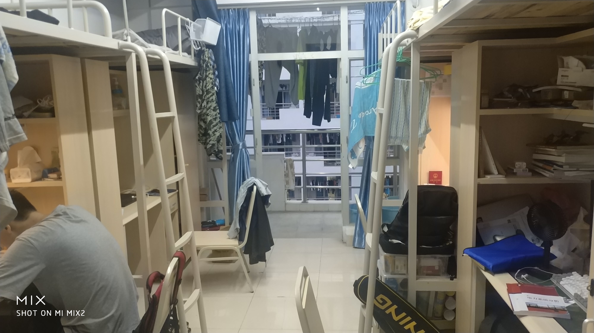
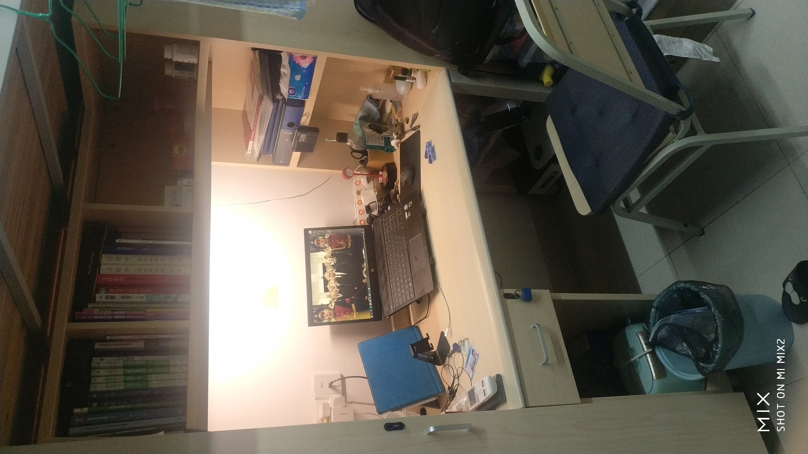

# 住宿

珠海校区有九栋宿舍，其中八栋、九栋是外招生宿舍，其余为内招生宿舍。内招生宿舍里，一、三、五栋为男生宿舍，其余为女生宿舍。

!> 因为学校男女比例日渐接近，四栋一楼也在2020-2021学年第一学期变成了男生宿舍。该层与上面楼层不互通，男生不能从直通大堂的楼梯出入，只能从后楼梯上下楼。

### 奇怪的房号问题

房号的规律是这样的：栋数+楼层数+两位数房间号，奇数房号在同一排，偶数房号在另一排。

由于一、二、三、四、八、九栋的大堂层（也就是地面层，港澳称“地下“）是没有宿舍的，所以这几栋的”一楼“实际上是从二楼开始的，类似港澳的楼层计算方式，比如”2214“实际上是在二栋的三楼，串门的时候不要搞错了。

!> 除非经过宿管允许，男女生之间不得串宿互访。

## 房型

珠海校区内招生宿舍统一为**上床下桌四人间**，外招生宿舍为两人间。

- 空调：有

- 洗衣机：自购，新学年初会冒出来一大群洗衣机助理

- 风扇：一些栋有，但笔者肯定一栋没有

- 床铺规格：90x190木板床，有蚊帐架

- 饮水机：有，使用桶装水，每年会有专人进行清洗，如果不放心也可以自购，**但是不要把原来的饮水机扔掉**

- 网络：宿舍WiFi全覆盖，书桌前有网线插口，参考[网络](network.md)部分

  下图是“某一间”男生宿舍：

  

  下图则是笔者的座位：

  

## 水电

### 饮用水

前文提到了宿舍是有饮水机的，使用桶装水，水房就在大堂。学生需要先到四栋购买水票，再凭水票和空桶在自己栋的宿管处拿水（新生第一次拿水则只需要水票，在宿管阿姨那里登记）。

女生如果觉得水太重的话（一桶水18.9L，5加仑），可以在水票上写上房号，阿姨会做好登记，然后就可以安心等勤工助学的送水队送上门，送水队周一到周五下午工作。

男生是要自己搬上去的，哪怕是7楼也要自己搬的。

### 自来水

学校水费是每学期结算，也没有地方可以查询用水量。

洗澡用的热水，每天下午五点半开始供应到当天结束。使用时需要把水卡（入住时在阿姨处领取的白卡）放在洗手间智能水表上，而智能水表只有在洗手间的灯被打开时才能工作，**所以宿舍没电连热水澡都没得洗**。

### 宿舍用电

!> 宿舍用电请遵守一切安全用电规则

#### 各个插座的位置和规格（一栋）

宿舍的每张书桌前面都会有一个插座，阳台有一个，宿舍空调独占一个带开关的插座。在洗手间靠床位的墙上也会有一个插座。

除了空调独占的插座外，宿舍里的插座都分别包含一个三脚插和一个两脚插；阳台的插座带防水盖，包含一个三脚插；空调独占的插座包含一个三脚插。

#### 用电限制

珠海校区对用电限制比较宽松，限制主要是在纯电阻负载上，比如电吹风，热得快等，功率在1000W以上的电器，购买时请三思。如果智能电表系统判定超出限制了，宿舍就会突然断电，~~你用台式机又不买UPS的舍友就会把你踹下楼~~，数分钟后会恢复。

?> 如果几分钟后还不恢复，思考一下你们是不是忘记交电费了。

根据宿舍管理规定，宿舍不允许有煮食电器。

宿舍管理规定的执行性不太好。

#### 电费标准、查询和缴交

珠海校区学生电费0.63元/度（千瓦时），查询可以在校园网访问[这个网站](http://202.116.25.12/)。

缴交电费需要到宿舍楼下的智能终端。进入缴费——珠海电费——放置校园卡——输入密码——输入房号——输入要充值金额——缴费成功。

!> 2020.10.14：缴交电费时，输入房号后会显示余额，但目前显示的余额极有可能不准确，所以宿舍没电了，就算显示还有电费那也真的是没电了。

## 维修

宿舍里原有的东西维修，只需要做一件事情：打电话，区别只是打给谁。

饮水机报修：因为饮水机实际上是汪之洋（也就是桶装水的供应商）负责维护，所以饮水机报修只能打电话8500666。

网络保修：网络中心电话8504603。

其他报修：可以到四栋填写保修单，也可以直接拨打四栋的电话8505448进行报修。

!> 不要大半夜的打过去，虽然我知道你们不会这么做的，但还是要提醒一下。

