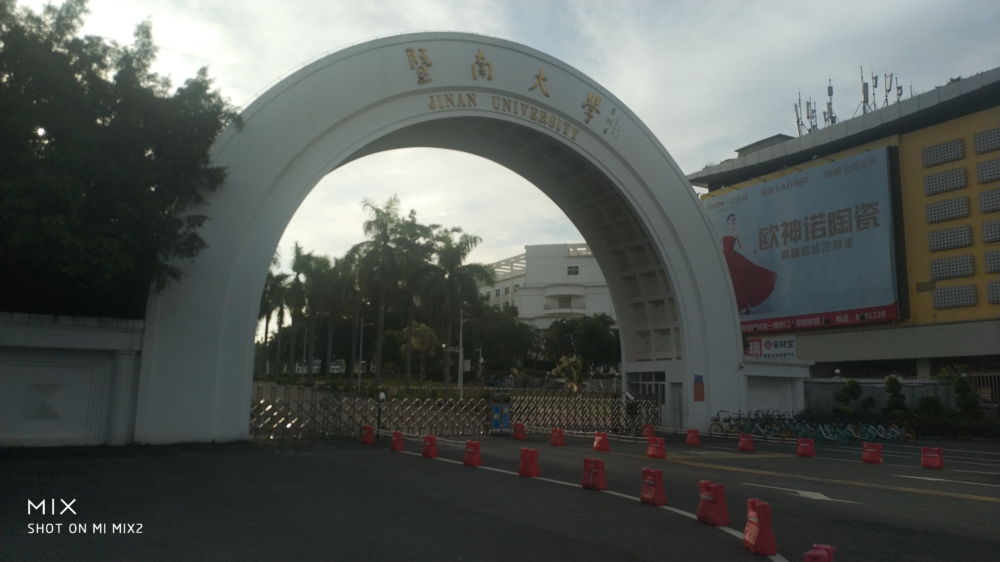

# 校园基本信息

- 校区名称：暨南大学珠海校区
- 校区英文名称：Jinan University Zhuhai Campus
- 地址：广东省珠海市香洲区前山路206号
- 英文地址：206 Qianshan Rd. , Xiangzhou District, Zhuhai, Guangdong, China
- 邮编：519070

!> 细心的你，可能会发现这里我用了”校区“，因为暨大珠海校区和中大珠海校区性质是一样的，都属于本校的分校区，而不是像珠海其他学校那样，是除了名字之外和本校没有多大联系的独立学校。所以请自信的告诉别人你来自**暨南大学**而不是暨南大学珠海校区。

## 出入口

### 北门

是最靠近生活区的出入口，也是学生最常用的出入口，一般外卖、快递和打车所说的“在门口”很有可能特指北门，打车回学校的时候记得提醒司机是北门，不然的话会走不少冤枉路。

### 西门（正门）

西门是学校最大的一个出入口，有暨大的标志性拱门建筑，靠近行政楼、体育场。从西门进入学校需要走一大段上坡路才能到达教学区和生活区，如非必要不要走，会累死。

### 南门

南门又称小南门，是离学生一般活动范围最远的一个出入口，靠近科技创新园、实验中心（红楼）和校区招待所。

南门被叫做小南门是因为它真的很小，它和北门在同一条路上，因此从南门进来一样要走一段上坡路，从南门进来的路路灯比较少而且靠山，晚上走的话注意安全。

## 学校平面图

