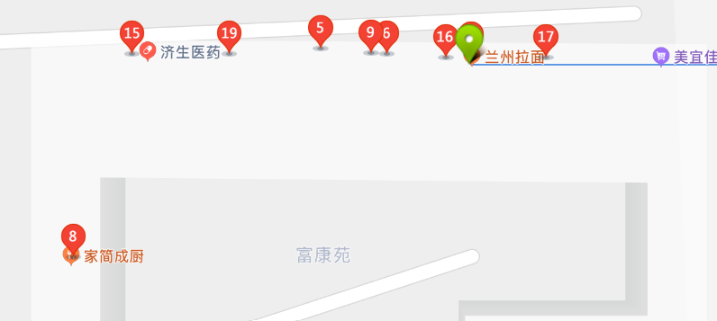

# 饮食

 民以食为天，学生也一样，珠海校区有一栋三层的饭堂、一间咖啡馆、两间小超市、一公里内有麦当劳、肯德基、真功夫和星巴克（快看，在市中心多好）。

## 学校饭堂及飞鸽服务

### 饭堂

!> 除了买饭票外，饭堂仅支持校园卡消费。

学校食堂分三层，每层菜式不一样，价格也逐层上升。二楼的菜式会比一楼更舍得用调味料，而且有烧味馆，（上二楼后最左侧，小卖部的右侧）。三楼的菜式比一楼二楼都要丰富和精致，价格自然也是最高的。至于具体有什么，自己去探索吧。三层楼都提供一日三餐、但**七点后的夜宵服务是二楼限定**。

三层都有卖饮料的小卖部，一楼和二楼都在正对点餐窗口方向的最左侧，三楼的则在正对点餐窗口的最右侧。小卖部还提供买饭票服务，**仅支持现金**。

另外食堂还设有~~清真~~风味餐区，据反馈饭量和菜量都会比较大，担心吃不饱的可以去试一下。

（此处应有照片，待添加）

### 飞鸽服务

!> 2020.9.19：飞鸽服务暂未恢复，据“暨南飞鸽”小程序，将于10月11日恢复服务。

飞鸽服务实际上就是饭堂的外卖。与一般外卖不同的是，飞鸽服务可以将外卖送到宿舍门口，而一般外卖只能送到宿舍楼下，真正做到了足不出户吃上饭（所以，不出门吃早餐的话，真的可以一整天都不出宿舍门的）。飞鸽有固定的配送时间，一般就是饭堂开放的时间，仅限午餐和晚餐。除了饭堂之外，飞鸽还提供北门周边部分餐饮店的外卖服务，具体可以搜索小程序**“暨南飞鸽”**查看。

## 苏格拉底咖啡馆

苏格拉底咖啡馆在图书馆旁，正门的右侧，有露天和室内座位，还有一个小包间，提供咖啡和轻食，部分座椅下面有插座。价格上比较小资，但是和外面的咖啡馆相比绝对是性价比之选。具体可以微信公众号搜索“JNUSocratesCafe"了解。小包间支持预约，有最低消费（好像也就是一杯饮料？）。因为苏格拉底咖啡馆的环境比较好，所以经常会有人在咖啡馆一坐就是一整天，工作或者是学习，~~当然狗粮是不会少的~~，而一些组织的面试和会议也会挑在露天座位进行。

?> 经常去吃的话可以办会员卡，有折扣。

!> 如非必要，不要随意占座。这不是图书馆，是咖啡厅，去吃东西发现位置被一群不吃东西的占领了真的会很让人抓狂。

咖啡馆人手和设备有限，出餐速度有很大的限制，尤其是咖啡馆的经典轻食——意面。如果人比较多，你又不打算在咖啡馆坐很长时间的话，不建议去那里解决三餐，不然的话，饭点的时候就要做好登上1hr+的准备，笔者曾经试过午餐被硬生生拖成了下午茶。另外虽然有统一的菜谱，但出品品质很大程度上取决于那天当班的那位水平如何（如果认识咖啡店管理层，你就可以每一顿都大赞/批判一番了）。

但是有什么办法呢，笔者就是喜欢他家的番茄味培根意面和芝士挞。

## 小超市、水果店和面包店

### 小超市

学校内有两家超市，规模相近、商品相近、定价相同（可能有少量商品会有五毛钱差别），都支持现金、微信、支付宝支付（不支持信用卡）。除了零食饮料、小超市也有各种日用品，水桶、拖把之类的，质量还过得去，也没有因为垄断而坐地起价。

### 水果店

学校里只有一家水果店，笔者不怎么吃水果，不太了解具体情况。所以这部分咕了咕了~

### 面包店

其实超市1也会卖一些面包，但如果你想有更多的选择，可以去马得利面包店看看，除了面包之外还有一些咖啡牛奶一类的，简直就是面包店标准模板，价格上难说有竞争力，但是也不会让人难以承受，至于面包品质那就见仁见智了，拿来做早餐也算是过得去。

> 笔者有多士炉，所以买的最多的是方包，烤起来可香了。

## 北门周边

如果学校内的饮食无法满足你~~开玩笑，能满足才怪~~，除了文首提到的几家and外卖之外，在北门外还有四、五家店铺供你选择。这几家店铺也是组织团建首选噢，特别是学校学生组织举办的大型活动之后，就会被举办活动的组织成员给挤爆，所以大型活动之后就不要去凑热闹了。

下面是北门外部分饮食店的列表，可以自己探索噢：

* 森伝：好贵一家餐馆，笔者没吃过，说不定会很好吃呢？

* 北门小吃店

* 吃出滋味

* 兰州拉面：普普通通一家兰州拉面

* **西门冒菜**：西门冒菜……在北门，可能以前在西门吧。

> 以下内容来自某位17级学姐的感慨，未经修改，不是我，不是我

最想写的~不是它的冒菜或者干锅，因为知道很多同学都超爱吃，有口皆碑的说！这次想写的是他的老板，也是超级好的一个人，不仅经常通过各种活动给我们学生带去福利，有一次还免费让我和室友品尝了烧烤新品。是这样的，老板在11点左右突然发了朋友圈，几张“烧烤图”加上配文“你来就请你吃哦”~一看就让人馋得不行，我开始以为老板是在开玩笑，没想到老板真的让我带着室友去吃，然后我和室友也是真不客气，赶着门禁吃了个痛快！从这次之后，对西门冒菜的好感度max，即使因为它的价格小贵没有常去吃，但还是很推荐的！

* **北门糖水**

> 以下内容来自同一个学姐的感慨，未经修改

最爱宵夜摊，经常打卡的地方！最爱的是温的暨大3号，新宠是“椰汁雪燕+紫薯+芒果+芋圆”，里面的各款糖水都可以私人定制哒，你可以增加自己喜欢的料也可以替换掉不喜欢的，价格是一样的公道哦！复习周的时候最爱外卖一杯奶茶，北门糖水的奶茶也很好喝，不知道你尝过没有，是比较偏港式奶茶的，奶盖也超好吃，珍珠等等的给料也很足！
有一阵子爱上了薏仁糖水，竟然发现北门糖水里也有薏仁糖水，就很开心地点了，吃了之后有一丢丢小失望，因为喜欢的是纯白的没有壳的薏仁，然后我就跟老板说了这事，给他推荐了更好吃的纯白薏仁！没想到老板超开心地接受了而且还让我给他发链接！几天后，我再一次去吃的时候，老板说买回来啦！让我尝尝看！真的是纯白薏仁！！！超好吃，心中满心的感动和尊重（上面两幅图你可以看看薏仁的对比哦~）

老板真的有很认真地经营这家店，很多款式都是他们自己研究出来的，而且用料也很实在，不舍得让学生吃亏。虽然这款薏仁糖水因为销量不好、原料有点贵等原因很快就下架了，但它永远在我的记忆里，让我感受到了生意人的那份真诚！希望回去的时候你还在呀！！！