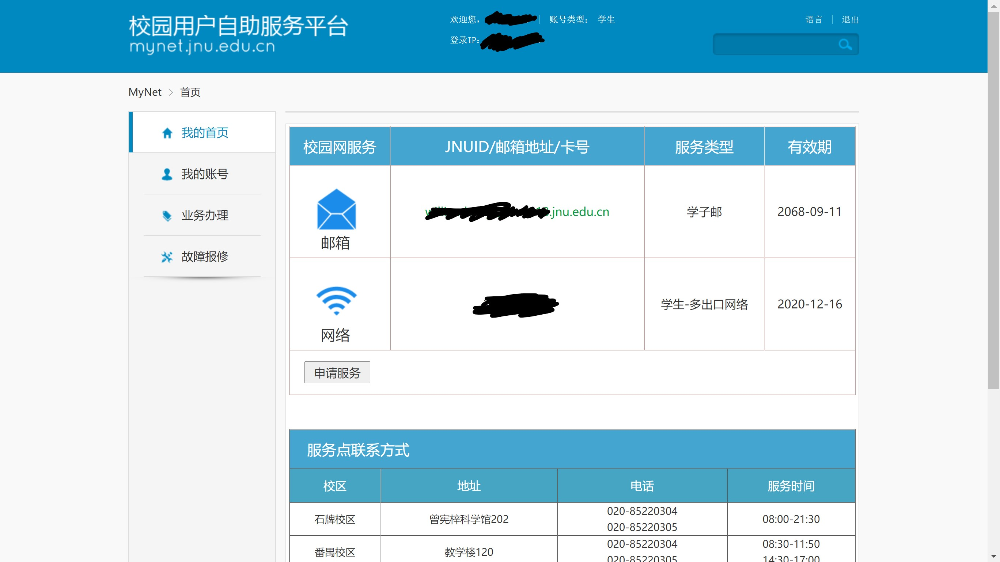
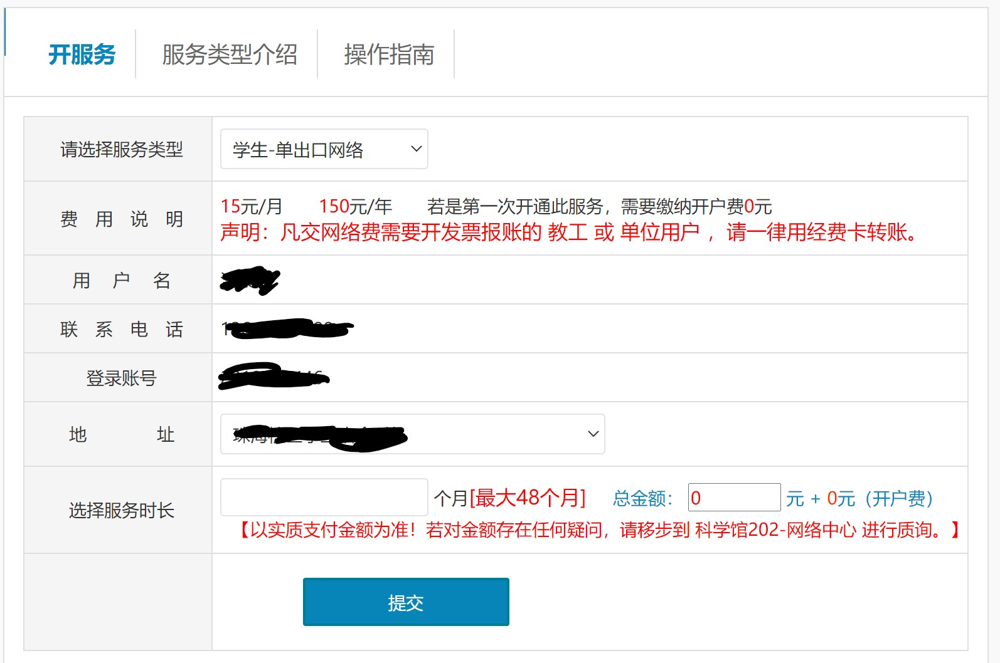
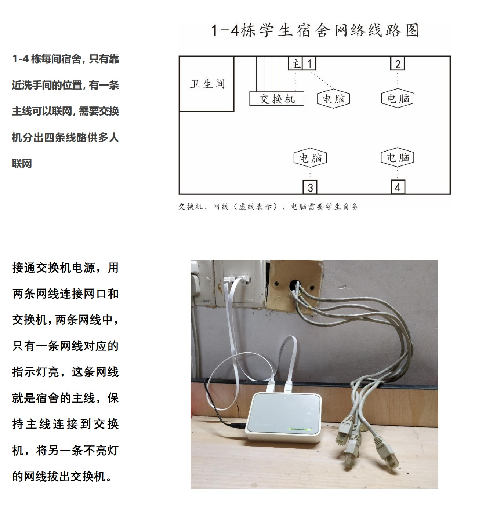
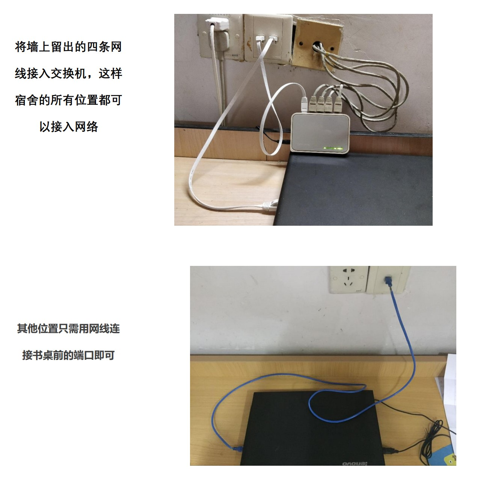
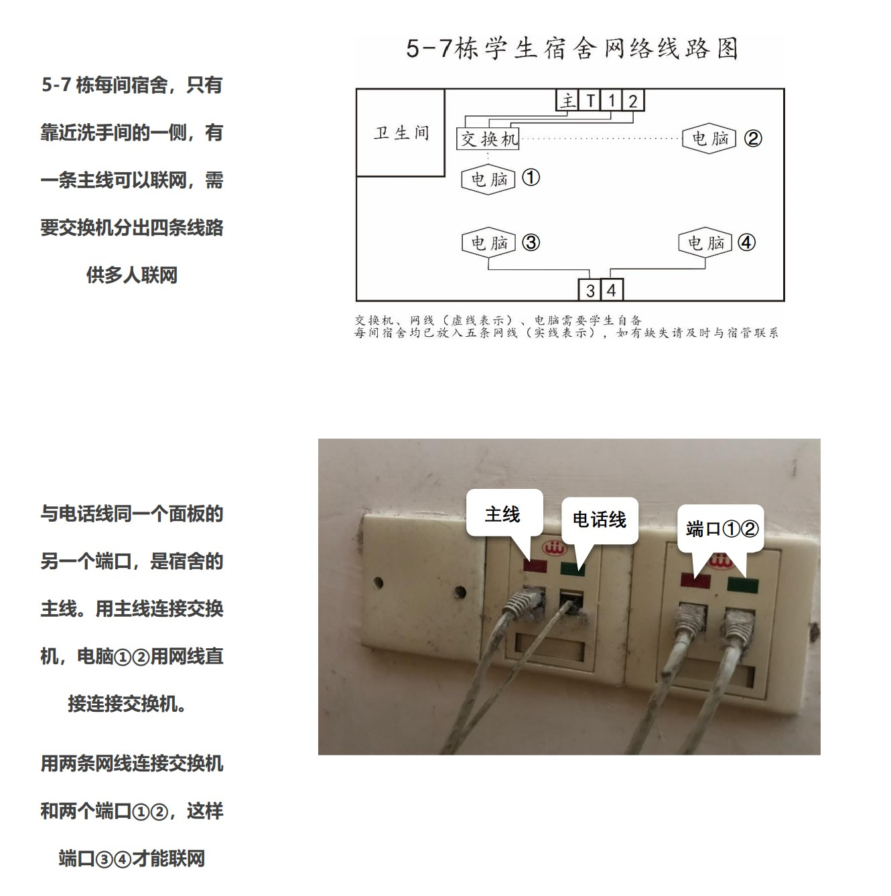

# 网络

暨南大学珠海校区全校覆盖WiFi，宿舍同时铺设了有线网络，但是使用起来属实麻烦，不过这也是各大高校校园网的特色了。

## 校园网购买和续费

校园网可以进行网上购买和续费，都是在[校园网用户自助服务平台](https://mynet.jnu.edu.cn)进行。

点击右上角“MyNET登录”，会弹出icas统一身份认证界面，登录后就是用户中心界面。

首次登录应该不会显示任何服务，点击“申请服务”或者右侧菜单的“业务办理”中的“申请服务”按钮，都会进入校园网申请页面。续费的入口也是一样的。

在“服务类型介绍”和“操作指南”里有比较单出口和双出口网络的详细介绍，双出口网络的价格是单出口的两倍。

!> 虽然但是，强烈建议购买双出口网络，同时买一年和按月买其实性价比是一样的，因为寒暑假不在学校的你也用不上校园网。

## 有线网络（Windows环境下）

笔者所在的一栋，实测有线网在大多数时候都可以保持接近100Mbps（10M/s，带宽全宿舍四个人共享）的速度，相比WiFi的不稳定，插网线可舒服多了。

?> 珠海校区有线网络使用H3C的iNode 802.1x认证，机房线路使用portal网页认证。宿舍网络可通过路由器802.1x认证。

### 需要准备的材料

- 一个交换机，一个五口交换机可以满足宿舍四个人的使用
- 带网线插口（RJ45）的电脑
- 网线。一人一条，校内超市就有得卖，不过质量欠佳，建议至少选用超五类标准的，1米即可
- 校园网（可以先用WiFi）环境下，在[这里](http://192.168.150.8)下载认证软件并安装（点击“有线网络”下的“Windows系统软件”），安装完成后可以选择“稍后再重新启动计算机”
- 足够的耐心

### 步骤

#### 连接交换机和网线

以下内容摘自珠海校区网络与教育技术中心的教程。

#### （关闭系统自带的802.1x认证）

大多数人不需要进行这一步，但有些电脑可能默认打开了自带的802.1x认证，虽然学校也使用802.1x，但是自带的认证是没有办法认证成功的，需要关闭。具体的关闭方式可以百度（或者搜狗、bing、yandex、Google， etc.）

#### 校园网认证

打开已经安装的校园网认证软件，输入用户名和密码，点击连接，第一次连接会要求选择正确的网卡，请选择有线网卡，一般来说会是“Realtek GBE Family Controller”之类的。

ENJOY!

由于交换机的存在，理论上宿舍四个人的电脑已经可以相互访问分享，不过笔者实测经常会出这样那样的奇怪问题（都怪校园网）。

!> 另外需要注意的是，不论是WiFi还是有线网络，周一至周四晚上12点-第二天早上6点（差不多是这个时间）都会断网。

## 无线网络

校内WiFi有两个，一个是JNU-SECURE，作为主要节点，另一个是JNU，作为备用节点。

**WiFi最多支持两个设备同时使用（多出口网络下）**

### JNU-SECURE
JNU-SECURE使用用户名和密码验证。
#### Windows 10
在WiFi选择页面点击JNU-SECURE，输入用户名和密码，如果弹出提示请选择“是”。
#### iOS
在WiFi选择页面点击JNU-SECURE，输入用户名和密码，第一次连接会弹出证书页面，选择“信任”。
#### Android
对于最近几年的智能手机，首次使用，在WiFi选择页面点击JNU-SECURE，输入用户名和密码后即可连接。

连接失败，排除是多设备登录冲突问题的话，在输入用户名和密码的地方点击“高级”，检查以下设置：
- EAP方法：PEAP
- 阶段二身份验证：无
- CA证书：不验证

### JNU
JNU采用portal网页认证，连接时不需要输入用户名和密码，连接后系统会自动提示需要认证并弹出认证页面，如果没有弹出，可以自行打开浏览器并点击任意域名，会自动跳转到认证页面。
在认证页面输入用户名和密码，点击“上线”，弹出在线时间窗口则登录成功。

## 多设备切换登录问题
因为WiFi最多只能同时两个设备同时使用，所以对于两个以上的上网设备，很多人会选择来回切换登录，也就是断开某一台设备的连接后，再连接另一台。但由于系统分配的IP地址不会立即释放，所以**就算是断开了上一台的连接，下一台也不一定马上能连接成功**。

宿舍连接有线网络的情况下，WiFi依旧可以连接两台设备，**在机房使用也可以视作连接WiFi**。

## 校园网络资源

下面是部分比较常用or入口比较隐蔽但是又很好用的校园服务。

[暨南大学官网](https://jnu.edu.cn)：万恶之源，值得花时间慢慢探索。

[暨南大学珠海校区官网](https://zh.jnu.edu.cn)：位于官网“组织机构-珠海校区”，有珠海校区各机构的入口。

[暨南大学 JNU WebVPN](https://webvpn.jnu.edu.cn/)：本科生在校外访问校内资源的重要入口，在校内，尤其是**选课**的时候就不要用这个入口了，急死你。

[暨南大学图书馆](https://lib.jnu.edu.cn/)：图书馆，就不用多说了吧，学校买了不少数据库，要善用。

?> 小安利：图书馆长朱勇的文献检索课值得一上。

[馆藏数字资源服务平台](http://202.116.13.24:9088/)：馆藏书电子扫描版的查询平台，用的是ip，可能随时会换，从图书馆网站也有查询入口，想找电子书的可以先来这里找找（笔者最近刚找到了一本18年版的马原）。

[学生电费查询平台](http://202.116.25.12/)：只有ip地址，珠海校区专属的宿舍电费查询平台，输入房号即可，没有密码。~~所以可以悄悄给女朋友宿舍充电费~~

[教务管理系统](http://jwxt.jnu.edu.cn/)：老教务系统，虽然2020年上半年就说要迁移到新系统，但至少到目前（2020年9月）还是有不少功能在这个老系统上。

[暨南大学教务系统网上办事服务大厅](https://jw.jnu.edu.cn/new/index.html)：新教务系统，希望功能会慢慢多起来。

[选课](https://jwxk.jnu.edu.cn/)：选课系统。大家都很熟悉了吧，根据新系统的技术文件，会支持20000人同时在线和5000人同时操作，所以第一轮选课应该是不成问题（分校区分年级分时选课），但第二轮选课嘛就......

[**暨大IPTV**](https://dtv.jnu.edu.cn/)：前面数了那么多，最想安利的其实是这个平台。有看首页的都知道这个网站的创建就源于学校的IPTV服务，提供的频道不多，但是有提供BBC World News、CNN、NHK、NGC、Discovery和～～（2020.09.30更新：前面的境外电视台不知道什么时候消失了）～～TVB（广东特供版）的标清直播，还要什么自行车呢。

