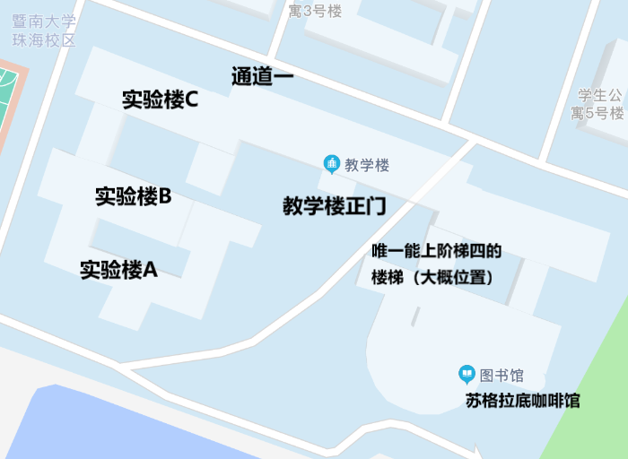
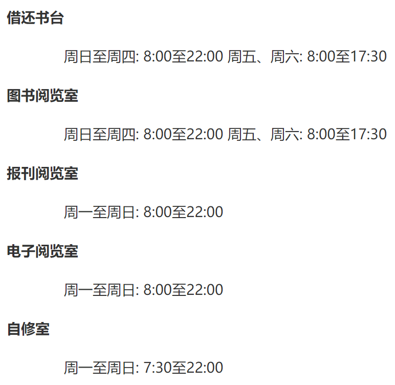

# 学习

前面写了这么多，终于到学习了，但是这一节不是讲学习方法的，只是提供一些相关的信息，**学习还是要靠自己啊**

## 上课地点

### 教学楼、实A、实B、实C

之所以放在一起讲，是因为它们几座其实是通过走廊连接在一起的，实 for 实验区（见基本信息部分的地图）。其中，实A和实B主要是实验室，实验课一般就在这两座。实C和教学楼则是一般课程的上课地点。教学楼的课室编号是教XXX（3位数字），实验楼则是实A/B/C+XXX（3位数字）

### 阶梯四

阶梯四是一个很有意思的阶梯教室。它的位置是在教学楼靠近图书馆一侧，因为教学楼部分空间被图书馆占用，所以能进入阶梯四的只有教学楼靠近图书馆后门入口的一条楼梯，从其他楼梯进入阶梯四所在的楼层，也是不能到达阶梯四的。不用担心找不到路，前往阶梯四的路上到处都是导向牌。

### 计算机中心（机房）

机房位于实验楼C三楼，CS相关课程就会在这里进行，机房会保留一个课外上机课室，课室安排会写在机房入口的白板处，如果有什么问题可以找机房办公室的老师或者穿着勤工助学制服的同学。

### 实验中心（红楼）

图片最南面的地方就是实验中心了，旁边就是招待所。工科的学生很快就会对这个遥远的地方熟悉起来的，不少的工科实验都会在这里进行。

噢对了，招待所也是有餐厅的，可以刷饭卡。

## 自习地点

硬件条件最好的自习室莫过于自己的宿舍，空调想开就开想关就关，单人单桌，不用担心没有插座，WIFI和有线网皆有。然而这种顶配自习室只有两个弊端，就是你头顶上的床，以及你身后大吼大叫玩LOL或者嘻嘻哈哈刷短视频的室友。因此不少人并不会把宿舍作为自己学习的第一选择。

### 图书馆

每个大学都有图书馆，但是有的图书馆特别小，比如暨南大学珠海校区的。

图书馆有前门和后门，前门在日月湖边，后门靠近教学楼。图书馆一共有三层，每层都有~~用来做作业的~~阅览室，有两人桌（比较少）、四人桌（最常见）和六人桌三种规格，部分靠墙的桌子有插座。图书馆的空调，冬暖（指天气变凉就不开导致图书馆特别闷热）夏凉（指夏天空调冷到可以让人感冒），同时一些位置靠近风机，噪音会比较大。每学期期末复习周以及考研季图书馆都会人满为患，开门前排队的人龙颇为壮观，如果没有早起早排队的魄力，这段时间还是选择其他地方自习吧。

图书馆开放时间如下图：

### 自习室

#### 宿舍自习室

除了部分楼层会有特别用途，每一栋宿舍的每一层楼都有自习室，楼梯间一出来就是。这个自习室条件一般，没有空调，只有风扇，但好处是用的人不多（夏天用实在是有点热），离宿舍比较近，不用担心忘带什么，而且理论上可使用时间是二十四小时，如果你愿意和巡楼的宿管阿姨斗智斗勇的话。

#### 教学楼自习室

每个学期教学楼都会开放一些课室作为固定自习室，另一些课室没课的时候就可以作为自习室，具体的课室信息每个学期开学会通过班委转发。一般来说，固定自习室都会塞满可怜的考研狗，而且虽然明令不可以在自习室占座，能够在固定自习室找到没有被占的座位依然是一件可以和考研成功难度相当的事情。

### 咖啡馆

这里说的当然是校内的苏格拉底咖啡馆（咖啡馆可以给我打钱吗），总会有人在咖啡馆坐上一整天。确实，比较安静，空调温度适中，而且伴随着咖啡的香气的咖啡馆确实是安心学习的好地方。然而苏格拉底对占座自习的容忍度比较低，想着一杯饮料坐一天，还是去星巴克吧。

### 市内其他地点

星巴克就不说了，最近的星巴克位于招商花园城。

#### 香洲区图书馆

香洲区图书馆是离学校最近的公立图书馆，在乐土文化区，装修比较新，特别养眼，周边饮食比较丰富，不用担心中午饿了找不到东西吃。但劣势是图书馆比较小（更像一个独立书店），座位自然就比较少，而且图书馆偶尔会有活动，就会比较吵。

#### 珠海市图书馆

珠海市图书馆比较老旧，位置也比较少，有些位置位于走廊，估计是为了满足学生自习的需要才加的，本身的自修室就比较小了，空调经常不太够用，而且靠近儿童馆的座位会非常吵。

说了那么多不好的，为什么还要提它呢？还不是因为你真的找不到位置……

#### 阅潮

阅潮是珠海分布最广的书店了，为了配合珠海市政府的社区治理政策，阅潮开设了许多社区书店。阅潮的社区书店除了书之外还有一些零食和饮料，其中每间书店都有的就是手冲咖啡，**真的好好喝**，就是贵了点。不少社区书店座位都不需要消费，但是有些会明确要求需要消费，所以，就买杯喝的吧。

阅潮社区书店的具体位置可以自己高德，最近三间阅潮分别位于圆明新园（直线1.3km）、华发商都（总店，直线3.5km）和华发四季（直线3.7km，接近实际路程距离）。

## 资料打印

除了下面介绍的两种途径，学校附近没有文印店。另外也可以自己买一台打印机，或者蹭办公室/实验室的打印机。

### 文印中心

文印中心位于图书馆，提供黑白打印和复印，平时由勤工助学的学生们管理，所以会有一定的亲切感（？），打印和复印的标准是一样的，0.1元/面，刷校园卡/现金支付。文印中心的电脑不能上网，有PDF阅读软件，office2010。

### 校内复印店

校内只有一家复印店，在学生活动中心后面，提供黑白、彩色打印和复印，是承包了学校店面的私营个体户。店面规模比文印中心小，环境也比较一般（主要是老板娘要带着孩子在这）。黑白打印和复印0.1元/面，彩色打印1块，微信/支付宝/现金支付。电脑可以上网，有微信，有PDF阅读软件，WPS，但是不要占用电脑找资料噢，会阻碍到别人的。

## 课本

每学期各学院会公布每门课程所需的课本，学校也会提供集中购买渠道，有部分优惠，但很少低于网络渠道。另外**十分建议购买二手书**。对于大部分人来说，在书上做笔记的机会屈指可数，书很多时候只会拿来看，甚至有些课程正式上课的时候连书都用不上，因此，在书这方面，十分建议购买二手书，如果有surface和ipad设备+触控笔的，电子书也很适合，甚至用电子书你做笔记的次数还会更多一点。
