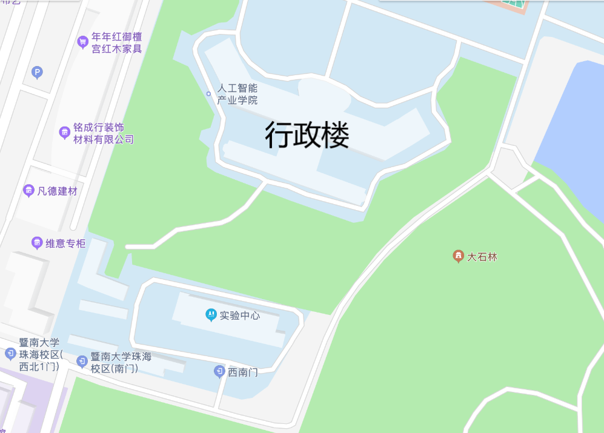

# 学习

前面写了这么多，终于到学习了，但是这一节不是讲学习方法的，只是提供一些相关的信息，**学习还是要靠自己啊**

## 上课地点

### 教学楼、实A、实B、实C

之所以放在一起讲，是因为它们几座其实是通过走廊连接在一起的。其中，实A和实B主要是实验室，实验课一般就在这两座。实C和教学楼则是一般课程的上课地点。教学楼的课室编号是教XXX（3位数字），实验楼则是实A/B/C+XXX（3位数字）

### 阶梯四

阶梯四是一个很有意思的阶梯教室。它的位置是在教学楼靠近图书馆一侧，因为教学楼部分空间被图书馆占用，所以能进入阶梯四的只有教学楼靠近图书馆后门入口的一条楼梯，从其他楼梯进入阶梯四所在的楼层，也是不能到达阶梯四的。不用担心找不到路，前往阶梯四的路上到处都是导向牌。

### 计算机中心（机房）

机房位于实验楼C三楼，CS相关课程就会在这里进行，机房会保留一个课外上机课室，课室安排会写在机房入口的白板处，如果有什么问题可以找机房办公室的老师或者穿着勤工助学制服的同学。

### 实验中心（红楼）

图片最南面的地方就是实验中心了，旁边就是招待所。工科的学生很快就会对这个遥远的地方熟悉起来的，不少的工科实验都会在这里进行。

噢对了，招待所也是有餐厅的，可以刷饭卡。

## 自习地点

### 图书馆

### 自习室

### 咖啡馆

### 市内其他地点

## 资料打印

### 文印中心

### 校内复印店

## 课本

